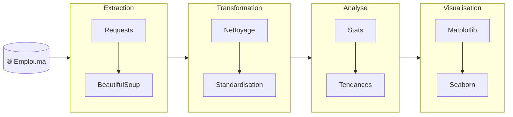
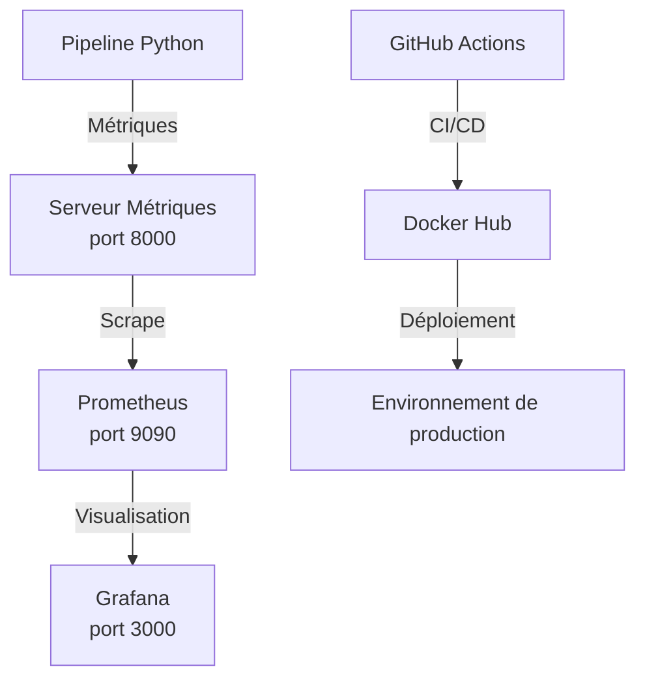

# 🚀 Job Market Pipeline - Analyse du Marché de l'Emploi au Maroc

[](https://www.python.org/)
[](https://www.docker.com/)
[](https://prometheus.io/)
[](https://grafana.com/)
[](https://github.com/ZainabElbouyed/job-market-pipeline/stargazers)

---

## 📋 Table des matières
- [Description](#-description)
- [Fonctionnalités](#-fonctionnalités)
- [Architecture](#-architecture)
- [Technologies](#-technologies)
- [Installation](#-installation)
- [Utilisation](#-utilisation)
- [Monitoring](#-monitoring)
- [Déploiement Docker](#-déploiement-docker)
- [CI/CD](#-cicd)
- [Résultats](#-résultats)
- [Structure du projet](#-structure-du-projet)
- [Contribution](#-contribution)
- [Auteur](#-auteur)

---

## 🎯 Description

**Job Market Pipeline** est un projet complet d'analyse du marché de l'emploi au Maroc. Il automatise la collecte, le nettoyage, l'analyse et la visualisation de **700+ offres d'emploi** provenant du site Emploi.ma.

L'objectif est d'identifier les **tendances du marché** et les **compétences les plus demandées** pour aider les chercheurs d'emploi et les recruteurs à prendre des décisions éclairées.

Le projet intègre une **architecture DevOps complète** avec conteneurisation Docker, monitoring Prometheus/Grafana et intégration continue.

---

## ✨ Fonctionnalités

| Fonctionnalité | Description |
|----------------|-------------|
| **🕷️ Web Scraping** | Collecte automatisée de 700+ offres avec Requests et BeautifulSoup |
| **🧹 Pipeline ETL** | Nettoyage, transformation et standardisation des données avec Pandas |
| **📊 Analyse statistique** | Identification des top compétences, régions, types de contrats |
| **🎨 Visualisation** | Graphiques professionnels avec Matplotlib, Seaborn et WordCloud |
| **🤖 Automatisation** | Scripts planifiables pour des collectes régulières |
| **📓 Notebooks Jupyter** | Démonstrations interactives de chaque étape |
| **🐳 Conteneurisation** | Déploiement avec Docker et docker-compose |
| **📈 Monitoring** | Métriques Prometheus et dashboards Grafana |
| **🔄 CI/CD** | Intégration continue avec GitHub Actions |

---

## 🏗 Architecture



---

## Architecture DevOps



---

## 🛠 Technologies

### **Langages & Bibliothèques**
| Technologie | Utilisation |
|-------------|-------------|
| **Python 3.8+** | Langage principal |
| **Requests** | Requêtes HTTP |
| **BeautifulSoup4** | Parsing HTML |
| **Pandas** | Manipulation et analyse de données |
| **NumPy** | Calculs numériques |
| **Matplotlib** | Visualisations de base |
| **Seaborn** | Visualisations avancées |
| **WordCloud** | Nuages de mots |
| **Schedule** | Automatisation des tâches |

### **DevOps & Monitoring**
| Technologie | Utilisation |
|-------------|-------------|
| **Docker** | Conteneurisation de l'application |
| **Prometheus** | Collecte et stockage des métriques |
| **Grafana** | Visualisation des métriques et dashboards |
| **GitHub Actions** | Intégration et déploiement continus |
| **Pushgateway** | Réception des métriques des jobs batch |

### **Outils de développement**
- **Jupyter Notebook** : Exploration interactive
- **Git** : Versionnement
- **Pytest** : Tests unitaires
- **psutil** : Métriques système
- 
---

## 📦 Installation

### **1. Cloner le repository**
```bash
git clone https://github.com/ZainabElbouyed/job-market-pipeline.git
cd job-market-pipeline
```

### **2. Créer un environnement virtuel**
```bash
# Windows
python -m venv venv
venv\Scripts\activate

# Linux/Mac
python3 -m venv venv
source venv/bin/activate
```

### **3. Installer les dépendances**
```bash
pip install -r requirements.txt
```

---

## 🚀 Utilisation

### **1. Scraping seul (collecte des données)**
```bash
python scripts/run_scraper.py --pages 30
```

### **2. Pipeline complet (scraping + analyse + visualisation)**
```bash
python scripts/run_pipeline.py --pages 30 --visuals
```

### **3. Analyse avec données existantes**
```bash
python scripts/run_pipeline.py --no-scrape --visuals
```

### **4. Exploration interactive avec Jupyter**
```bash
jupyter notebook
# Ouvre ensuite notebooks/01_scraping.ipynb
```

### **5. Automatisation (exécution programmée)**
```bash
# Exécution quotidienne à 9h
python scripts/scheduler.py --daily --time "09:00"

# Exécution toutes les 6 heures
python scripts/scheduler.py --interval 21600
```

---

## 📈 Monitoring

### **1. Lancer le serveur de métriques**
```bash
# Terminal 1
python scripts/metrics_server.py
```

### **2. Lancer Prometheus et Grafana avec Docker**
```bash
cd docker
docker-compose -f docker-compose.monitoring.yml up -d
```

### **3. Accéder aux interfaces**
| Service | URL | Identifiants |
|-------------|-------------|-------------|
| **Métriques** | `http://localhost:8000/metrics` | - |
| **Prometheus** | `http://localhost:9090` | - |
| **Grafana** | `http://localhost:3000` | admin/admin | 

### **Métriques disponibles**
- **jobs_collected_total** : Nombre total d'offres collectées
- **scraping_duration_seconds** : Temps d'exécution du scraping
- **errors_total** : Nombre d'erreurs rencontrées
- **memory_usage_bytes** : Utilisation mémoire
- **disk_usage_bytes** : Utilisation disque

---

## 🐳 Déploiement Docker

### **1. Build de l'image**
```bash
cd docker
docker build -t job-market-pipeline -f Dockerfile ..
```

### **2. Lancer avec docker-compose**
```bash
# Pipeline seul
docker-compose up -d

# Avec monitoring
docker-compose -f docker-compose.monitoring.yml up -d
```

### **3. Voir les logs**
```bash
docker-compose logs -f
```

### **4. Arrêter les conteneurs**
```bash
docker-compose down
```

---

## 🔄 CI/CD
| Workflow | Déclencheur | Actions |
|-------------|-------------|-------------|
| Tests | Push sur main | - Installation des dépendances <br> - Linting avec flake8 <br> - Tests unitaires avec pytest |
| Build Docker | Push sur main | - Build de l'image Docker <br> - Push sur Docker Hub |
| Déploiement | Push sur main | - Déploiement automatique |

---

## 📊 Résultats

### **Données générées**
| Dossier | Contenu |
|---------|---------|
| `data/raw/` | Fichiers CSV bruts (jobs_YYYYMMDD.csv) |
| `data/processed/` | Données nettoyées et transformées |
| `analysis/reports/` | Rapports statistiques (.txt) |
| `visualization/outputs/` | Graphiques PNG |

### **Exemples de visualisations**
- **Top 20 des compétences** les plus demandées
- **Top 15 des villes** qui recrutent
- **Répartition des types de contrats** (CDI, CDD, Intérim...)
- **Nuage de mots** des intitulés de poste
- **Heatmap** compétences par région

---

## 📁 Structure du projet

```
job-market-pipeline/
│
├── 📂 data/                           # Données brutes et traitées
│   ├── raw/                           # Données scraping originales
│   │   └── jobs_YYYYMMDD_HHMMSS.csv
│   └── processed/                      # Données nettoyées
│       └── jobs_clean.csv
│
├── 📂 scraper/                         # Module de collecte
│   ├── __init__.py
│   ├── config.py                       # URLs, headers, constantes
│   ├── utils.py                         # Fonctions helpers
│   ├── scraper.py                       # Classes/fonctions principales
│   └── scraper.ipynb                     # Démo et tests
│
├── 📂 pipeline/                          # Pipeline ETL
│   ├── __init__.py
│   ├── cleaner.py                        # Nettoyage des données
│   ├── transformer.py                     # Transformation
│   └── pipeline.ipynb                      # Orchestration
│
├── 📂 analysis/                           # Analyse statistique
│   ├── __init__.py
│   ├── stats.py                            # Fonctions d'analyse
│   ├── reports.py                           # Génération de rapports
│   ├── reports/                             # Rapports générés
│   └── analysis.ipynb                        # Exploration
│
├── 📂 visualization/                       # Graphiques
│   ├── __init__.py
│   ├── plots.py                              # Fonctions de visualisation
│   ├── styles.py                              # Configuration des styles
│   ├── outputs/                                # Images sauvegardées
│   └── plots.ipynb                             # Démo
│
├── 📂 notebooks/                           # Notebooks de démonstration
│   ├── outputs/                              # Images sauvegardées
│   ├── 01_scraping.ipynb
│   ├── 02_pipeline.ipynb
│   ├── 03_analysis.ipynb
│   └── 04_visualization.ipynb
│
├── 📂 scripts/                             # Scripts d'automatisation
│   ├── metrics.py                            # Définition des métriques
│   ├── metrics_server.py                      # Serveur Prometheus
│   ├── monitoring.py                          # Monitoring pipeline
│   ├── run_scraper.py                         # Scraping programmé
│   ├── run_pipeline.py                         # Pipeline complet
│   ├── run_production.py                       # Exécution en production
│   ├── scheduler.py                            # Planification
│   └── test_metrics.py                         # Test des métriques
│
├── 📂 tests/                                # Tests unitaires
│   ├── test_scraper.py
│   └── test_cleaner.py
│
├── 📂 docker/                               # Configuration Docker
│   ├── Dockerfile
│   ├── docker-compose.yml
│   ├── docker-compose.monitoring.yml
│   └── .dockerignore
│
├── 📂 .github/                              # CI/CD
│   └── workflows/
│       └── scraper-ci.yml
│
├── 📂 monitoring/                           # Configuration monitoring
│   ├── prometheus.yml
│   └── grafana/
│       └── dashboards/
│           └── scraper-dashboard.json
│
├── 📄 requirements.txt                      # Dépendances
├── 📄 .gitignore                              # Fichiers à ignorer
└── 📄 README.md                               # Documentation
 
```

---

## 🤝 Contribution

Les contributions sont les bienvenues ! Voici comment contribuer :

1. **Fork** le projet
2. Crée ta branche (`git checkout -b feature/ma-feature`)
3. **Commit** tes changements (`git commit -m 'Ajout de ma feature'`)
4. **Push** vers la branche (`git push origin feature/ma-feature`)
5. Ouvre une **Pull Request**

---

## ✨ Auteur

**Zainab EL BOUYED** - [GitHub](https://github.com/ZainabElbouyed) - [LinkedIn](https://www.linkedin.com/in/zainab-el-bouyed-85700535b/)

---

⭐ **Si ce projet t'a aidé, n'hésite pas à lui mettre une étoile !** ⭐
